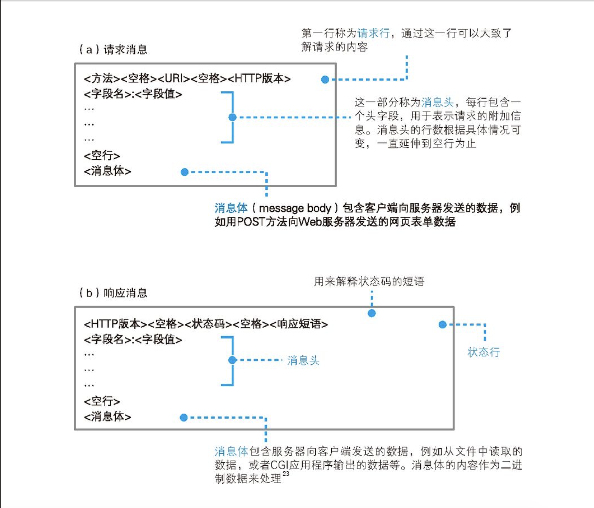

# web浏览器

-   浏览器如何解析网址？
-   请求消息实际的样子？
-   如何向DNS服务器查询web服务器对应的IP地址？
-   全世界上万台的服务器，如何接力完成IP地址的查询？

```
    浏览器的第一步工作：对URL进行解析
```
```
1. 协议类型（协议方法）：http / ftp / file / mailto
2. 访问目标统称为URI（统一资源标识符）
```

<table>
    <caption>HTTP的主要方法<caption>
    <tr>
        <td>方法</td>
        <td>含义</td>
    </tr>
    <tr>
        <td>GET</td>
        <td>获取URI指定信息</td>
    </tr>
    <tr>
        <td>POST</td>
        <td>客户端向服务端发送数据，用于表单等</td>
    </tr>
    <tr>
        <td>HEAD</td>
        <td>与GET类似，但只返回HTTP消息头，用于获取文件最后更新时间等属性</td>
    </tr>
    <tr>
        <td>PUT</td>
        <td>替换URI指定服务器上的文件，不存在时创建</td>
    </tr>
    <tr>
        <td>DELETE</td>
        <td>删除URI指定服务器上的文件</td>
    </tr>
    <tr>
        <td>TRACE</td>
        <td>将服务器收到的请求行和头部直接返回，用于在使用代理的环境中检查改写请求的情况</td>
    </tr>
    <tr>
        <td>CONNECT</td>
        <td>使用代理传输加密消息时使用</td>
    </tr>
</table>

 

 > 表1.2 HTTP中主要的头字段

 <table>
    <caption>HTTP状态码</caption>
    <tr>
        <td>状态码</td>
        <td>含义</td>
    </tr>
    <tr>
        <td>1xx</td>
        <td>告知请求的处理进度和情况</td>
    </tr>
    <tr>
        <td>2xx</td>
        <td>成功</td>
    </tr>
    <tr>
        <td>3xx</td>
        <td>表示需要进一步操作</td>
    </tr>
    <tr>
        <td>4xx</td>
        <td>客户端错误</td>
    </tr>
    <tr>
        <td>5xx</td>
        <td>服务器错误</td>
    </tr>
 </table>

```
    第二步：根据域名查询IP地址（浏览器使用Socket库中的DNS解析器进行域名解析）
```
```
3. TCP/IP网络是由小的子网通过路由器连接起来组成的
4. IP地址是一串32bit的数字，按照8bit（1字节）为一组分为四组用.隔开，但网络号和主机号的具体结构不固定
5. 子网掩码表示网络号和主机号的边界，主机号部分全为0时表示整个子网，全为1时表示向所有设别发送包(广播)
    eg:[‘10.11.12.0/225.225.225.0’,'10.11.12.225/24']
6. DNS(Domain Name System) 域名服务系统
7. 缓存：指将使用过的数据存放在离使用该数据的地方比较近的高速存储装置中，以便提高后续访问速度的技术
```